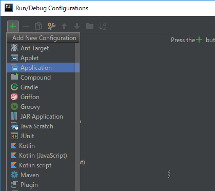
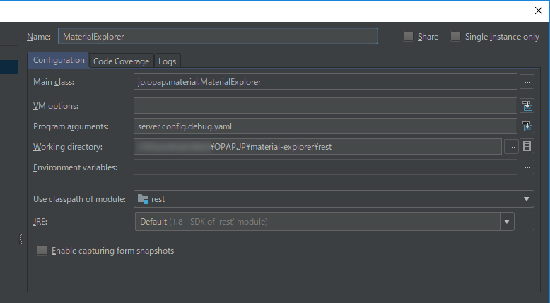

# Material Explorer

素材検索システム（仮称）

## アプリケーションの構成

このアプリケーションは、Docker を用いた**マイクロサービスアーキテクチャ**です。このアプリケーションは、`web`, `rest`, `db`, `im` の 4 つの Docker サービスで構成されています。

|コンテナ名|説明|
|:-|:-|
|web|ウェブサーバー。 `*.html`, `*.js` など静的なファイルのみを公開し、JavaScript を通じて `rest` へのリクエストを行ない、取得したデータに応じた動的な内容を表示します。|
|rest|REST サーバー。 `web`とは別のホスト名で公開され、`web` を通してリクエストを受けます。`db` の読み書きと、外部の Git リポジトリの取得を行ないます。|
|db|データベースサーバー。 `rest` による読み書きが行なわれます。|
|im|サムネイル生成サーバー。 受信した画像をサムネイルに変換します。`rest`によって利用されます。|

`Dockerfile` は、 Docker コンテナごとに記述する、どのような Docker イメージをビルドするかを記述するビルドスクリプトです。

**Docker Compose** は、複数の Docker コンテナを、それぞれどのように起動するかやどのように連携するかを設定して、マイクロサービスアーキテクチャを容易に起動する仕組みです。Docker Compose の設定は **YAML**（`docker-compose.yaml`）で記述します。

### 4 つのコンテナ

#### web コンテナ

静的なファイルのみを公開する、**nginx** によるウェブサーバーです。

エンドユーザーによるリクエストが行なわれ、クライアントサイドで JavaScript が実行されます。
JavaScript は、`rest` コンテナが提供する REST サーバーにリクエストを行ない、取得したデータに応じた動的な内容を表示します。

##### ビルド

ソースコードの形式として **TypeScript**, **SCSS** が用いられています。

公開されるファイルのビルドは、Docker イメージのビルド中に npm によって行われます。npm によって、Vue CLI のビルドが実行されます。Vue CLI によって、内部的に webpack が実行されます。公開されるファイルが生成されます。これらのファイルが所定のディレクトリに配置され、 nginx によって公開されます。

生成される JavaScript ファイルには、REST サーバーのホスト名が記述されますが、これは、デバッグ時と公開時で切り替えられる必要があります。デバッグ時は `http://localhost:8080`，公開時は `https://api.example.com` のようなインターネット上で参照できるホスト名 です。この切り替えは、`docker-compose.yaml`で、ホスト名をビルド時に参照できるパラメーターを設定し、設定された値を webpack スクリプト内でシステム**環境変数**を通して**間接的に**取得し、JavaScript ファイル上のプレースホルダを取得した値で置換することで実現しています。

**npm** は、JavaScript のビルドツールです。設定ファイルに記述されているライブラリをダウンロードし、ビルドのためのコマンドを実行します。

**Vue CLI** は、フロントエンドフレームワーク Vue.js のプロジェクトのためのコマンドラインツールです。

**webpack** は、さまざまな設定で JavaScript へのコンパイルを行なうためのツールです。TypeScript から JavaScipt へのコンパイル、多数の JavaScript ファイルの，少数のファイルへの**バンドル**、JavaScript ファイル上のプレースホルダを環境変数で置換するなどの処理を行ないます。

- フロントエンドフレームワークとして [**Vue.js**](https://jp.vuejs.org/index.html) を利用しています。
- CSS フレームワークとして [**Semantic UI**](https://semantic-ui.com/) を利用しています。

#### rest コンテナ

REST サーバーです。

プログラミング言語として **Scala** を利用し、フレームワークとして Dropwizard を利用しています。

**Dropwizard** は、**Java** で実装された軽量 REST アプリケーションフレームワークです。HTTP サーバーとして常駐する機能も備えています。

Dropwizard を利用したプログラムは、実行時に設定ファイル（**config.yaml**）を適用できます。設定ファイルのスキーマは開発者が定義します。

この REST サーバーは、素材データを構成するために、複数の Git リポジトリのデータをなんらかのイベント（アプリケーション起動時，ユーザーによるデータ更新の命令があったときなど）によって取得します。
取得したデータをもとに素材データを構成・更新し、ユーザーからの閲覧や検索に対応します。
`db` コンテナに対して、リポジトリのデータや素材データの読み書きが行なわれます。

取得するリポジトリは、アプリケーションの管理者が（プログラムの設定ファイルとは別に）ファイルで記述します。

リポジトリのデータを取得する方法はいくつかあり、取得するリポジトリごとに設定します。Git リポジトリホスティングサービス（GitLab など）の API を利用して取得する方法があります。

##### ビルド

Scala プロジェクトを **sbt** でビルドし、実行可能な `*.jar` ファイルを生成します。

生成された `*.jar` ファイルは所定のディレクトリに配置されます。

#### db コンテナ

データベースサーバーです。MongoDB を利用します。

**MongoDB** は、**スキーマレス**（データベーススキーマの定義がない）かつ、複雑なデータを格納できるドキュメント指向データベースです。

##### ビルド

既存の公式 Docker イメージを利用します。

#### im コンテナ

Web API として提供されるサムネイル生成サーバーです。ImageMagickを利用します。

- アプリケーションが ImageMagick を利用するには、OS に ImageMagick がインストールされている必要があるため、開発者ごとに ImageMagick をインストールする必要がありました。
  また、プロダクション環境と開発環境でバージョンの差異が発生することになります。  
  このコンテナは、そのような問題を解決するものです。
- **ImageMagick** は、さまざまな形式の画像を変換できる機能を持つソフトウェアです。
- Web API 化のため、 Python Flask フレームワークを用いています。

##### ビルド

Flask アプリケーションが配置されます。

### 2 つの Docker Compose 設定

プロジェクト内には、テスト用と開発用の 2 つの Docker Compose 設定ファイルがあります。

**テスト用**（`docker-compose.test.yaml`）は、 4 つの Docker コンテナを起動し、公開時とほとんど同じように動作します。ブラウザで、実際の動作を確認できます。

**開発用**（`docker-compose.yaml`）は、`db`, `im` のみを起動します。後述する開発環境を整えることで、テスト用の構成に対して頻繁な Docker イメージのビルドを必要としないため、効率的な開発ができます。

### 開発環境

#### Windows

[Docker for Windows](https://docs.docker.com/docker-for-windows/install/)がインストールされていることが前提です。

##### Scala 環境

1. 統合開発環境 [IntelliJ IDEA Community Edition](https://www.jetbrains.com/idea/download/#section=windows) をインストールします。
1. IntelliJ IDEA を起動し、[Wellcome to IntelliJ IDEA] ウィンドウで、 "Configure" -> "Plugins" -> "Browse Repositories" を開きます。
  "Scala" を検索し、インストールします。IntelliJ IDEA を再起動します。
1. "Import Project" で、 (project)/rest/build.sbt を開きます。
1. 適当な SBT バージョンを指定してダウンロードします。
1. Scala プロジェクトが開かれます。
1. "Edit Configuration" を開き、新規の "Application" を作成します。  
   
  
1. "Name" に適当な名称を入力します。 
  "Main class" で `jp.opap.material.MaterialExplorer` を選択します。 
  "Program arguments"に `server config.develop.yaml` と入力します。 
  "Use classpath module" で "rest" を選択します。 
  

##### npm 環境

1. [Node.js](https://nodejs.org/ja/download/) をインストールします。

### Docker Compose によるアプリケーションの実行

#### Windows

[Docker for Windows](https://docs.docker.com/docker-for-windows/install/)がインストールされていることが前提です。

##### テスト用コンテナ

1. Windows PowerShell を開き、カレントディレクトリがこのプロジェクトのルートフォルダ（`docker-compose.yaml` があるフォルダ）になるようにします。
1. `docker-compose -f .\docker-compose.test.yaml up --build` で Docker イメージのビルドとコンテナの起動を行ないます。初回のビルドには20分前後の時間がかかります。
1. [http://localhost](http://localhost) でアプリケーションの動作を確認できます。
1. Ctrl + C で Docker コンテナをシャットダウンします。

##### 開発用コンテナ

1. Windows PowerShell を開き、カレントディレクトリがこのプロジェクトのルートフォルダ（`docker-compose.yaml` があるフォルダ）になるようにします。
1. `docker-compose up --build` で Docker イメージのビルドとコンテナの起動を行ないます。
1. IntelliJ IDEA で、事前に設定した構成でプロジェクトを起動します。[http://localhost:8080](http://localhost:8080) でREST サーバーが実行されます。
    - プログラムを終了し、変更してから再び起動すると、変更が反映されたプログラムが起動します。
1. 別の Windows PowerShell を開き、カレントディレクトリが `web` になるようにします。
    - 初回か、`package.json` が更新されたときは、`npm install` を実行します。
1. `npm run serve` で、開発用ウェブサーバーが起動します。[http://localhost:8000](http://localhost:8000) が自動的に開かれます。
    - Gulp によってファイルの変更が監視されているため、ソースを変更すると自動的にコンパイルが行なわれ、画面も自動的に更新されます。
1. REST サーバーの開発ではウェブサーバーを実行しておき、ウェブサーバーの開発では REST サーバーを実行しておくようにしましょう。
